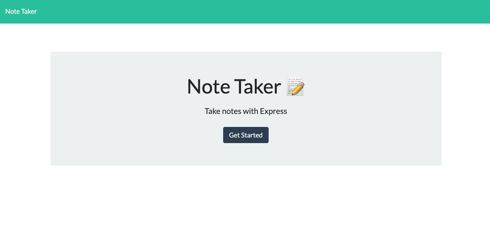
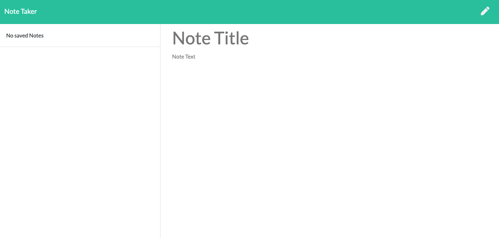
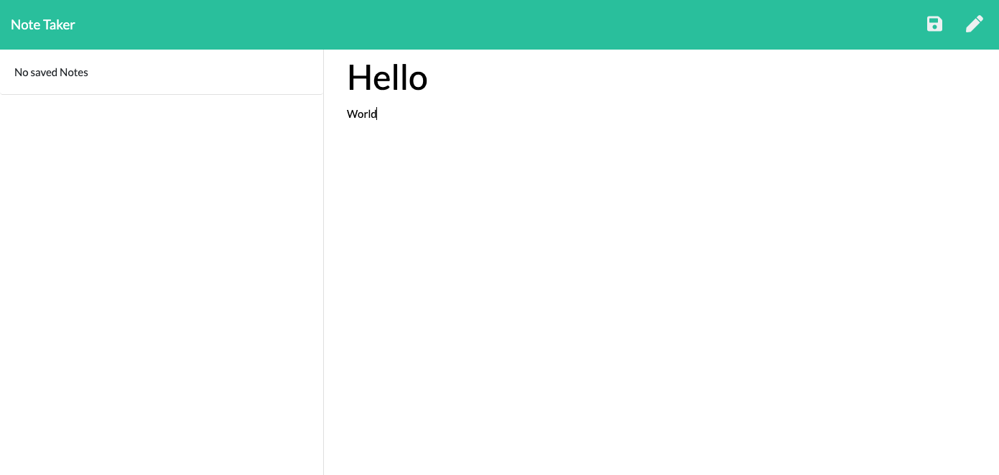
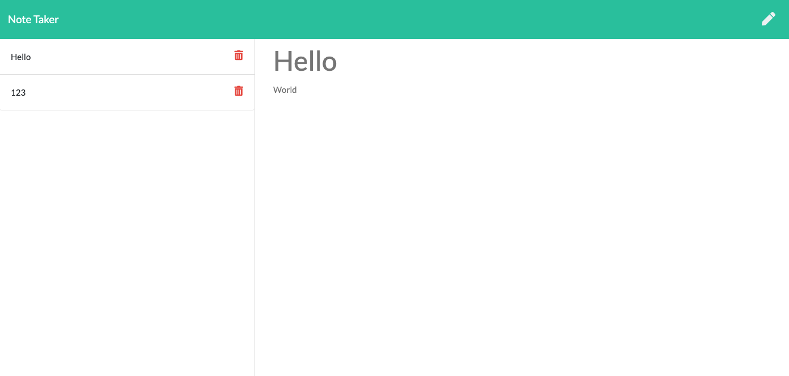

# Note-Taker

HW 11 OSU Bootcamp

## Description

This application uses javascript libraries to save and retrieve data from a JSON file to create a 'note-taker'. Users can enter new notes as they please and they can delete them when necessary.

#### Technologies Used

- Javascript
- [NodeJS](https://nodejs.org/en/)
- [npm](https://docs.npmjs.com/)
- [ExpressJS](https://expressjs.com/)
- [Heroku CLI](https://devcenter.heroku.com/articles/heroku-cli)
- [uuidv4](https://www.npmjs.com/package/uuid)

## Table of Contents

- [Screenshots](#screenshots)
- [Installation](#installation)
- [Questions](#questions)
- [License](#license)

## Screenshots

Root path

Enter a new note

Save note when both fields are filled out

Click on existing note to display or click to delete

## Installation

Using the terminal, clone the repository to your local device using SSH or HTTPS. Once cloned, open repository in a text editor to make changes.

## Questions

Created by: [Youngin9210](https://github.com/Youngin9210)

For any further information or questions please contact me at [kyleyoung.9210@gmail.com](mailto:kyleyoung.9210@gmail.com)
